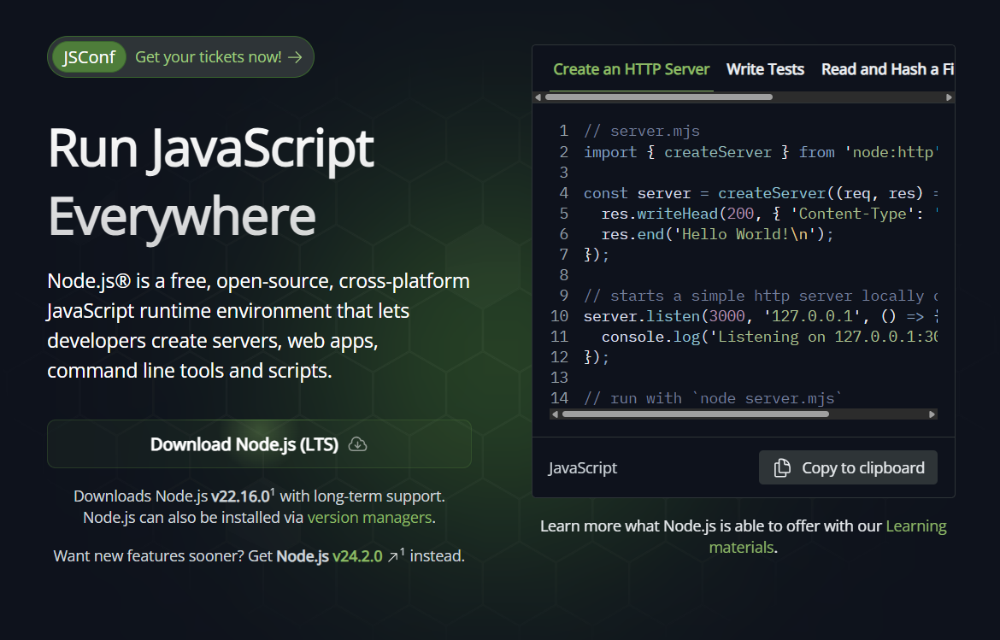

# NPM 설치 및 사용법

## Node.js란?


Node.js는 브라우저 밖에서도 자바스크립트를 실행할 수 있는 환경을 의미합니다. Node.js가 나오기 전까지는 자바스크립트가 브라우저의 동작을 제어하는데 사용되었고 브라우저에서만 실행할 수 있었지만 이제는 Node.js로 자바스크립트를 브라우저 밖에서도 실행할 수 있게 되었습니다.


## NPM이란?
NPM(Node Package Manager)은 Node.js를 설치하면 자동으로 설치가 됩니다. NPM은 명령어로 자바스크립트 라이브러리를 설치하고 관리할 수 있는 패키지 매니저로, 전 세계 자바스크립트 개발자들이 모두 자바스크립트 라이브러리를 공개된 저장소에 올려놓고 npm 명령어로 편하게 다운로드 가능합니다.


## Node.js 설치


다운로드 : https://nodejs.org/ko/

Node.js 설치시 NPM도 함께 설치가 되며, 터미널 실행 후 아래 명령어를 통해 버전 체크하여 설치가 정상으로 되었는지 확인 가능합니다.

```bash
$ node -v
v12.16.1

$ npm -v
6.13.4
```
> VScode에서 터미널 명령어 정상적으로 실행이 되지 않은 경우 bash가 아닌지 확인 필요.


## NPM 명령어
초기설정
`npm init`
실행하면 터미널 화면을 통하여 아래 항목를 설정하는 단계를 거처 최종적으로 package.json 파일로 생성합니다.

| 순서 | 항목           | 설명                        |
|------|----------------|-----------------------------|
| 1    | package name   | 패키지 이름                 |
| 2    | version        | 버전                        |
| 3    | description    | 설명                        |
| 4    | entry point    | 진입 파일                   |
| 5    | test command   | 테스트 명령어               |
| 6    | git repository | 깃 저장소                   |
| 7    | keywords       | 키워드                      |
| 8    | author         | 작성자                      |
| 9    | license        | 라이선스                    |

일반적으로 터미널 상태에서 설정하기 보다 package.json 파일에서 직접 변경하는 것이 직관적이므로 `$ npm init -y` 명령어를 통하여 터미널 설정화면을 생략하고 package.json 을 생성합니다.


## 패키지 설치
`$ npm install 패키지명`

설치 예시로 jQuery 라이브러리를 설치한다면 `$ npm install jquery`입니다.  

설치 가능한 패키지는 [npmjs.com](https://www.npmjs.com)에서 찾아볼 수 있습니다.  
패키지를 최초로 설치하면 `node_modules` 폴더가 생성됩니다.  
설치된 패키지 파일은 `node_modules` 하위 폴더(예: `jquery`)에서 찾을 수 있습니다.  
설치된 패키지 버전 관리는 `package.json`의 `dependencies` 항목에서 가능합니다.

패키지 제거는 `$ npm uninstall 패키지명` 명령어를 실행하면 설치된 패키지와 관련된 파일이 모두 삭제됩니다.

## 패키지 전역 설치
패키지를 전역으로 설치하려면 `--global` 키워드를 사용합니다.  
예를 들어, jQuery를 전역으로 설치하려면 `$ npm install jquery --global` 명령어를 실행하면 됩니다.  

전역 설치와 관련된 상세 내용은 [여기](https://docs.npmjs.com/cli/v9/commands/npm-install)를 참고하시기 바랍니다.  
전역 설치 시 패키지가 다운로드되는 경로는 아래와 같습니다.

### Windows
```
%USERPROFILE%\AppData\Roaming\npm\node_modules
```

### macOS
```
/usr/local/lib/node_modules
```

## 정리

NPM은 Node.js의 패키지 매니저로, 자바스크립트 라이브러리를 설치하고 관리하는 데 매우 유용합니다. Node.js와 NPM을 설치한 후, 다양한 패키지를 설치하고 관리할 수 있으며, 이를 통해 개발 환경을 효율적으로 구성할 수 있습니다.